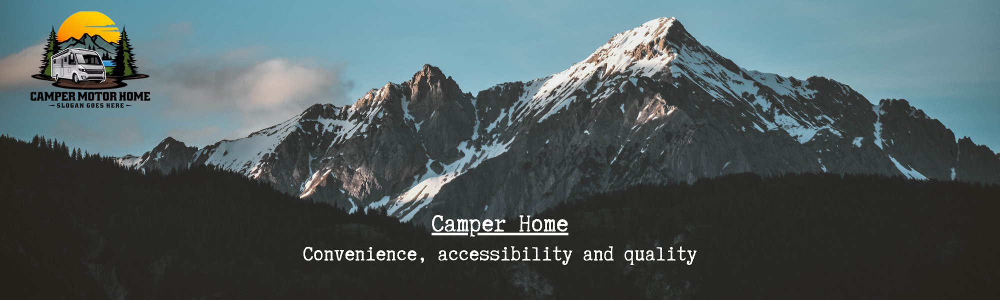
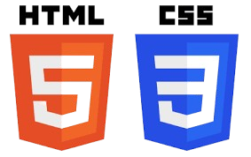

 

**Hello traveler**

Do you want to travel with ease and comfort? Then check out our website.

Welcome to our RV rental website, your ultimate destination for comfortable and
adventurous travel experiences. We offer a wide selection of high-quality,
fully-equipped motorhomes that cater to all your needs, whether you're planning
a weekend getaway or an extended road trip. Explore the open road in style and
convenience, with flexible rental options and exceptional customer service to
ensure your journey is as smooth and enjoyable as possible. Start your adventure
with us today!

**Tools that were used in the development of the site.**

<ul>
<li> 
Development environments and code editors:
 Visual Studio Code </li>
<li> 
Wealth Management Tools:
 Redux </li>
<li> 
Routing tools:
 React Router </li>
<li> 
Form Processing and Validation Tools:
 Formik, Yup </li>
<li> 
Assembly and automation tools:
 Vite </li>
<li> 
Dependency Management Tools:
 npm </li>
<li> 
Tools for working with API:
 Axios </li>
</ul>

<code></code>
<code></code>
<code></code>
